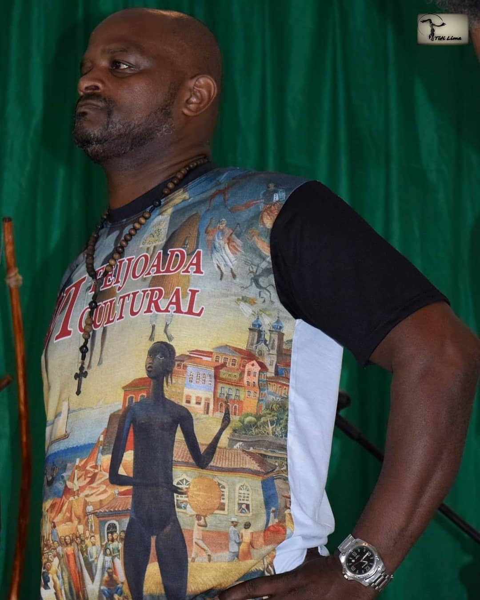

# Centro Cultural Corda Preta - Grupo de Capoeira

Este é o repositório oficial do Centro Cultural Corda Preta, um grupo de capoeira sediado na cidade de Cataguases-MG, Brasil.

## Sobre o grupo

O Centro Cultural Corda Preta foi criado em 07/09/2008 pelo então Instrutor Filinho, que atualmente é Mestre Filinho. Nosso grupo valoriza a tradição da capoeira e promove a sua prática como uma expressão cultural, esportiva e de arte marcial.

## Imagens

Aqui estão algumas imagens do nosso grupo:

## Redes Sociais

Siga-nos em nossas redes sociais para ficar por dentro das novidades:

- Instagram: [centrocultural.cordapreta](https://www.instagram.com/centrocultural.cordapreta)
- Facebook: [centroculturalcordapreta](https://www.facebook.com/centroculturalcordapreta)

---

&copy; 2023 Centro Cultural Corda Preta. Todos os direitos reservados.

## TECNOLOGIAS ENVOLVIDAS
- HTML e CSS
- JavaScript

## CONTATO DESENVOLVEDOR

